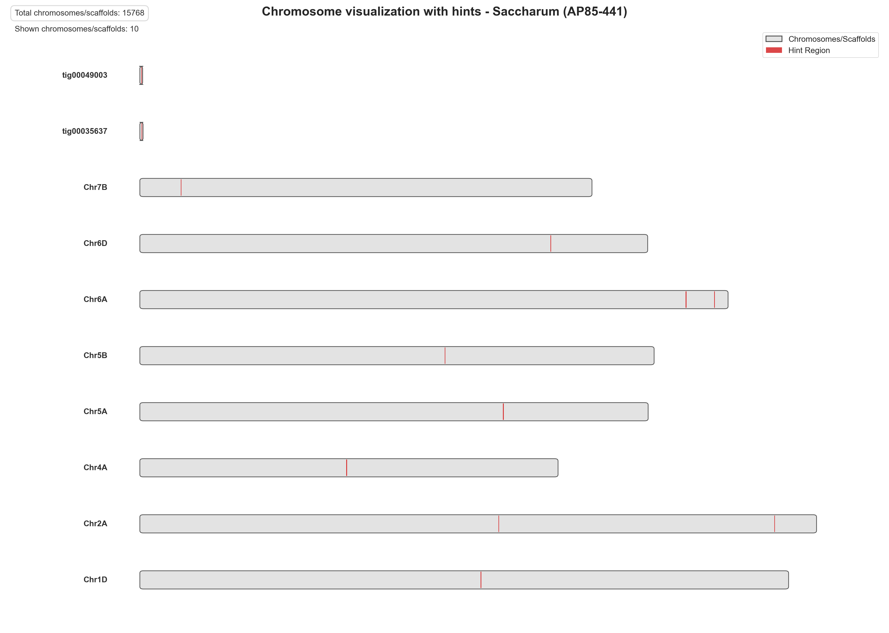

# Protein To Position Pipeline (PTPP)

> A pipeline developed for the analysis of chromosome position of target protein sequences.
Developed by Pedro Carvalho
linktr.ee/carvalhopc

## 🤝 Disclaimer

This pipeline was developed for personal use as part of my own [Bioinformatics Repositories](https://github.com/capuccino26?tab=repositories) and no updates or pull requests are guaranteed.
Feel free to fork and modify as your own.

## 📄 License

This project is licensed under the [MIT License](LICENSE).

---
## 📘 Flow
1 - (1_EXT_SPECIES.py) Generate list of species from PROT_IDS.* (xlsx, tsv, csv) file.
** The file PROT_IDS.* (xlsx, tsv, csv) is a table containing the ID from the FASTA file and the species:
| ID           | Tax_Name                  |
|--------------|---------------------------|
| 00000409.0   | Triticum urartu           |
| 0450.1       | Triticum dicoccoides      |
| 0540.2       | Triticum dicoccoides      |
| 00000870.0   | Triticum urartu           |
| 1012         | Zea mays                  |
| 223610g512   | Saccharum hybrid cultivar |
| 224218g536   | Saccharum hybrid cultivar |
| F4HQX1_JAL   | Arabidopsis thaliana      |
** This step can be skipped and you can manually generate your own table for step 2.

2 - (2_GENOMES_DOWNLOAD.py) Download genomes from BLAST.
** You can generate the input table manually, only the column "Species" is required with all the species/genus you will use for further steps:
Species;Frequency
Arabidopsis_thaliana;360
Zea_mays;346
Oryza_sativa_subsp__japonica;291

** This step has limitations related to the "datasets" software from NCBI, it is recomended to manually download the genomes files (If you get errors the files will be corrupted). this script can, however, help with bulk experiments.

3 - (3_GENOMES_UNZIP.sh) Unzip genomes.
** This step is required IF you downloaded the datasets from NCBI (files ncbi_dataset.zip).
** If you manually downloaded the FASTA files this is not required.

4 - (4_GENOMES_MOVE.sh) Move genomes.
** This step organizes the correct genomes files to the data/genomes folder

5 - (5a_GENOMES_MAKEDB_INDIVIDUAL.sh) Generate BLAST Databases.
** This step will generate the genomes based on the unziped files.
** If you manually downloaded the FASTA files, you can adapt the script (5b_GENOMES_MAKEDB_MODEL.sh) to merge the files and make the DB.

6 - (6_SEQUENCES_SPLIT.py) Split FASTA sequences files.
** This step is set to reduce the workload from huge FASTA files and chunk analysis, you can split your input sequences by their species or by their genus.

7 - (7_SEQUENCES_TBLASTN.sh) Run tblastn to obtain nucleotide sequences and select the best hits.
** EXAMPLE output (Best Hits):
135556F1	XTT22_Chr6K	91.667	72	3	3	3	71	15576679	15576464	8.95e-31	127
135556F2	XTT22_Chr6K	44.304	79	40	3	74	151	18215165	18215392	1.22e-08	63.9
135556F3	ZZ1_YZ-Ss-Chr07A	97.101	69	1	1	4	71	87040965	87040759	2.50e-31	129

8 - (8_AUGUSTUS.py) Extract the sequences hints and positions from the genomes and run [AUGUSTUS](https://github.com/Gaius-Augustus/Augustus) with Wheat as reference.
** EXAMPLE output (Hint File):
XTT22_Chr6K	blastX	exonpart	15576464	15576679	8.95e-31	-	.	grp=135556F1;pri=4;src=M
XTT22_Chr6K	blastX	exonpart	18215165	18215392	1.22e-08	+	.	grp=135556F2;pri=4;src=M
ZZ1_YZ-Ss-Chr07A	blastX	exonpart	87040759	87040965	2.50e-31	-	.	grp=135556F3;pri=4;src=M

9 - (9_EXONERATE.py) Run Exonerate for ab initio mapping.
** Exonerate is discontinued by EBI, use with caution.
** WARNING: HIGH CPU AND MEMORY USAGE!

10 - (10_SCHEMA.py) Generate the chromosomes schematics with all marked regions previously identified.

---

## 🚀 Features

- Use of tblastn to process protein sequences into nucleotide sequences
- Use of AUGUSTUS to process nucleotide sequences to gather chromosome position information

---

## 🛠️ Usage

```bash
git clone https://github.com/capuccino26/PTPP.git
cd PTPP
./install.sh
```
** You can run each script individually from bin/ folder, the program provides an interface for ease of use.

## 📂 Project Structure
PTPP/
├── bin/
│   ├── 1_EXT_SPECIES.py
│   ├── 2_GENOMES_DOWNLOAD.py
│   ├── 3_GENOMES_UNZIP.sh
│   ├── 4_GENOMES_MOVE.sh
│   ├── 5a_GENOMES_MAKEDB_INDIVIDUAL.sh
│   ├── 5b_GENOMES_MAKEDB_MODEL.sh
│   ├── 6_SEQUENCES_SPLIT.py
│   ├── 7_SEQUENCES_TBLASTN.sh
│   ├── 8_AUGUSTUS.py
│   ├── 9_EXONERATE.py
│   ├── 10_SCHEMA.py
│
├── inputs/
│   └── <empty folder>
│
├── outputs/
│   └── <empty folder>
│
├── data/
│   ├── blast_db/
│   │   ├──<empty folder>
│   └── genomes/
│       └──<empty folder>
│
├── environment.yml
├── install.sh
├── LICENSE
├── main.cpp
└── README.md
